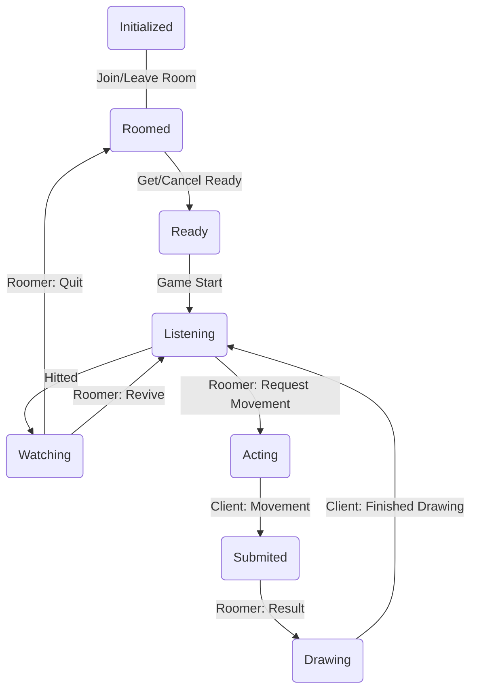
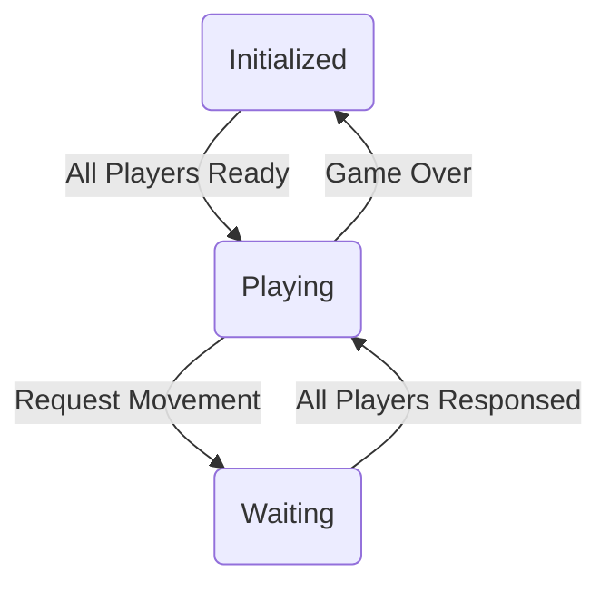

# 拍手游戏（The Clapping Game）

[游戏规则](./gamerule.zh.md)

## 开发构建

构建开发模式（带有 source map)：

```bash
yarn run build-dev
```

构建生产版本：

```bash
yarn run build
```

直接启动开发服务器（nodemon）：

```bash
yarn serve
```

## 运行维护

使用 `pm2` 管理进程。需要 `npm install pm2 -g` 安装。

进程控制：

```bash
pm2 [start|restart|stop|delete] clapping-game-backend
```

## 状态管理

`Room` 对象的主要任务是维护游戏逻辑的实现。`Player` 对象充当玩家，而 `Client` 充当用户。

本质上是 `Client` 和 `Room` 发送指令改变 `Player` 的状态，而 `Player` 发送指令到 `Client` 请求交互。

如果断线重连，那么新建一个 client 与 player 重新绑定一下即可。检查 player 的状态就可以还原当时的场景。

### 玩家状态



### 房间状态


